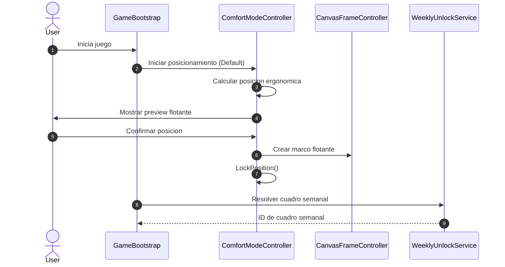
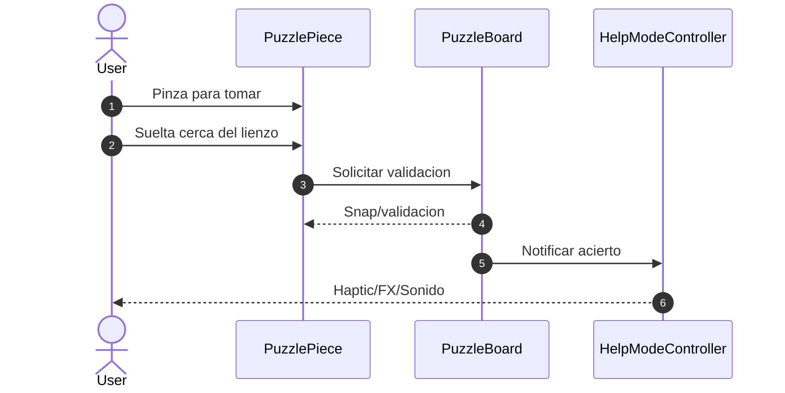
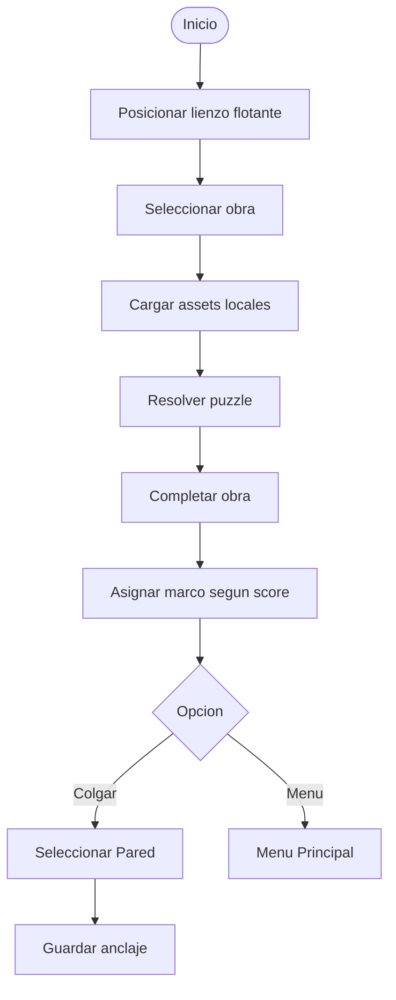
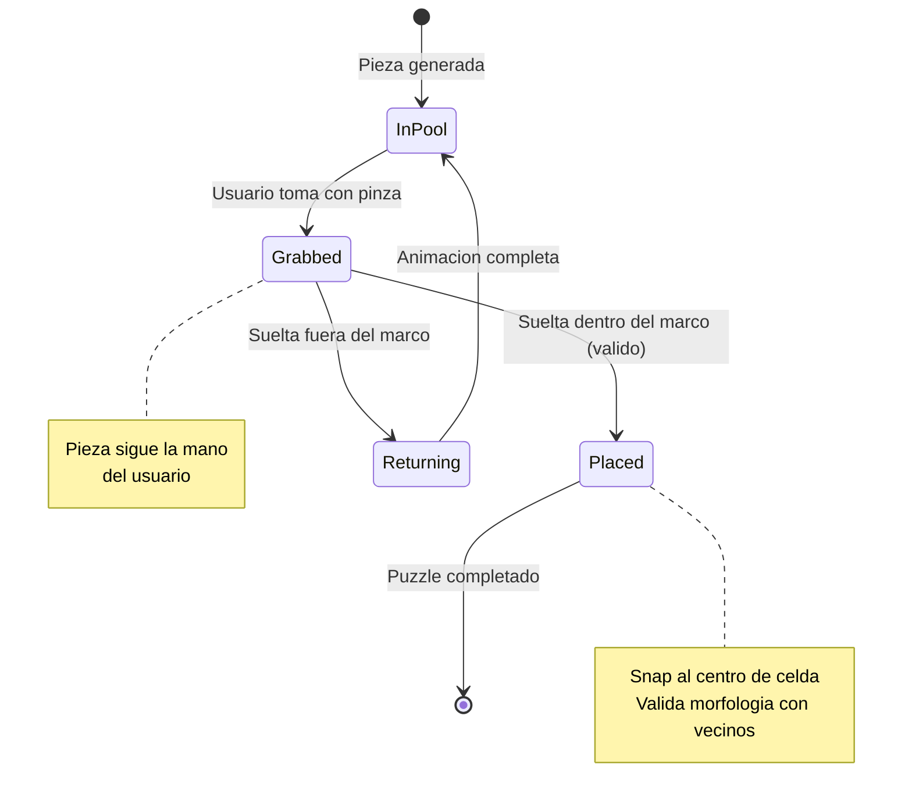
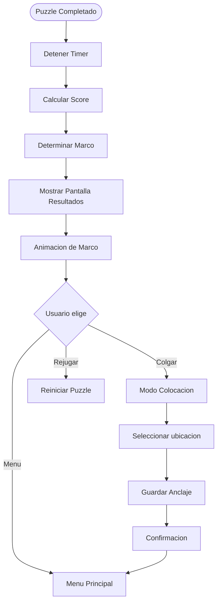
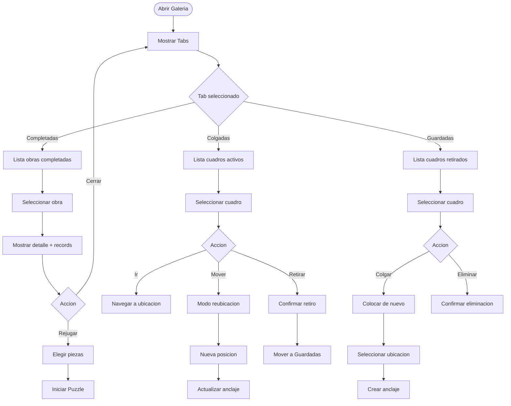
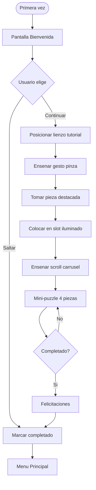
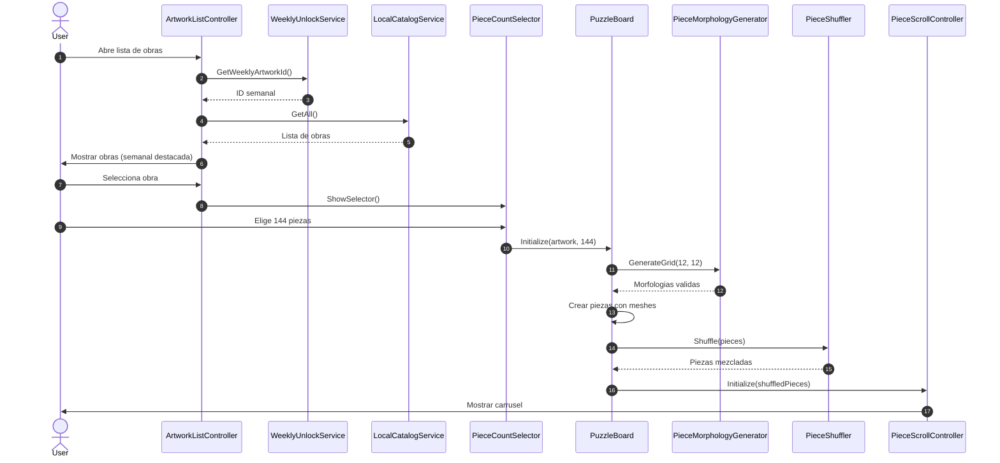

# Diagramas: Art Unbound

```mermaid
classDiagram
%% Core
class GameBootstrap
class SaveDataService
class LocalCatalogService
class WeeklyUnlockService
class LocalTelemetryService

%% MR Controllers
class WallSelectionController
class ComfortModeController
class CanvasFrameController
class AnchorPersistenceController
class WallHighlightController

%% Gameplay Controllers
class PuzzleBoard
class PuzzlePiece
class PieceMeshGenerator
class PieceMorphologyGenerator
class PieceShuffler
class HandTrackingInputController
class HelpModeController
class PieceScrollController
class ScoringController
class PuzzleTimerController

%% UI Controllers
class PieceCountSelectorController
class PostGameController
class GalleryPanelController
class ArtworkDetailController
class PauseMenuController
class SettingsController
class OnboardingController
class ArtworkListController

%% Feedback Controllers
class HapticController
class FrameAnimationController
class AudioManager

%% Cuadros Colgados
class PlacedArtworkController

%% Enums
class PieceState {
    <<enumeration>>
    InPool
    Grabbed
    Placed
    Returning
}

class PieceEdgeState {
    <<enumeration>>
    Flat
    Positive
    Negative
}

class FrameTier {
    <<enumeration>>
    Madera
    Bronce
    Plata
    Oro
    Ebano
}

class GameMode {
    <<enumeration>>
    Gallery
    Comfort
}

%% Relaciones Core
GameBootstrap --> SaveDataService
GameBootstrap --> LocalCatalogService
GameBootstrap --> WeeklyUnlockService
GameBootstrap --> LocalTelemetryService

%% Relaciones MR
WallSelectionController --> CanvasFrameController
WallSelectionController --> WallHighlightController
ComfortModeController --> CanvasFrameController

%% Relaciones Gameplay
PuzzleBoard --> PuzzlePiece
PuzzleBoard --> ScoringController
PuzzleBoard --> HelpModeController
PuzzleBoard --> PieceMeshGenerator
PuzzleBoard --> PieceMorphologyGenerator
PuzzleBoard --> PuzzleTimerController
PuzzlePiece --> PieceState
PuzzlePiece --> PieceEdgeState
PieceMeshGenerator --> PieceEdgeState
PieceMorphologyGenerator --> PieceEdgeState
HandTrackingInputController --> PuzzlePiece
HandTrackingInputController --> PieceScrollController
PieceScrollController --> PuzzlePiece
PieceScrollController --> PieceShuffler

%% Relaciones UI
ArtworkListController --> PieceCountSelectorController
PuzzleBoard --> PostGameController
PostGameController --> FrameAnimationController
GalleryPanelController --> ArtworkDetailController
GalleryPanelController --> PlacedArtworkController
GalleryPanelController --> LocalCatalogService
GalleryPanelController --> AnchorPersistenceController

%% Relaciones Feedback
HelpModeController --> HapticController
HelpModeController --> AudioManager
PostGameController --> AudioManager
ScoringController --> FrameTier

%% Relaciones Cuadros
PlacedArtworkController --> AnchorPersistenceController
```

```mermaid
sequenceDiagram
autonumber
actor User
participant Bootstrap as GameBootstrap
participant Comfort as ComfortModeController
participant Frame as CanvasFrameController
participant Weekly as WeeklyUnlockService

User->>Bootstrap: Inicia juego
Bootstrap->>Comfort: Iniciar posicionamiento (Default)
Comfort->>Comfort: Calcular posicion ergonomica
Comfort->>User: Mostrar preview flotante
User->>Comfort: Confirmar posicion
Comfort->>Frame: Crear marco flotante
Comfort->>Comfort: LockPosition()
Bootstrap->>Weekly: Resolver cuadro semanal
Weekly-->>Bootstrap: ID de cuadro semanal
```

```mermaid
sequenceDiagram
autonumber
actor User
participant Piece as PuzzlePiece
participant Board as PuzzleBoard
participant Help as HelpModeController

User->>Piece: Pinza para tomar
User->>Piece: Suelta cerca del lienzo
Piece->>Board: Solicitar validacion
Board-->>Piece: Snap/validacion
Board->>Help: Notificar acierto
Help-->>User: Haptic/FX/Sonido
```

```mermaid
flowchart TD
Start([Inicio]) --> Position[Posicionar lienzo flotante]
Position --> Select[Seleccionar obra]
Select --> Load[Cargar assets locales]
Load --> Play[Resolver puzzle]
Play --> Complete[Completar obra]
Complete --> FrameAward[Asignar marco segun score]
FrameAward --> UserOption{Opcion}
UserOption -->|Colgar| SelectWall[Seleccionar Pared]
UserOption -->|Menu| MainMenu[Menu Principal]
SelectWall --> Place[Guardar anclaje]
```

```mermaid
stateDiagram-v2
    [*] --> InPool: Pieza generada
    InPool --> Grabbed: Usuario toma con pinza
    Grabbed --> Placed: Suelta dentro del marco (valido)
    Grabbed --> Returning: Suelta fuera del marco
    Returning --> InPool: Animacion completa
    Placed --> [*]: Puzzle completado

    note right of Grabbed
        Pieza sigue la mano
        del usuario
    end note

    note right of Placed
        Snap al centro de celda
        Valida morfologia con vecinos
    end note
```

## Diagrama de Flujo Post-Juego

```mermaid
flowchart TD
    Complete([Puzzle Completado]) --> StopTimer[Detener Timer]
    StopTimer --> CalcScore[Calcular Score]
    CalcScore --> GetTier[Determinar Marco]
    GetTier --> ShowResults[Mostrar Pantalla Resultados]
    ShowResults --> FrameAnim[Animacion de Marco]
    FrameAnim --> UserChoice{Usuario elige}
    UserChoice -->|Colgar| PlaceMode[Modo Colocacion]
    UserChoice -->|Rejugar| Restart[Reiniciar Puzzle]
    UserChoice -->|Menu| MainMenu[Menu Principal]
    PlaceMode --> SelectWall[Seleccionar ubicacion]
    SelectWall --> SaveAnchor[Guardar Anclaje]
    SaveAnchor --> Confirm[Confirmacion]
    Confirm --> MainMenu
```

## Diagrama de Flujo Galeria Personal

```mermaid
flowchart TD
    OpenGallery([Abrir Galeria]) --> ShowTabs[Mostrar Tabs]
    ShowTabs --> TabChoice{Tab seleccionado}

    TabChoice -->|Completadas| ListCompleted[Lista obras completadas]
    TabChoice -->|Colgadas| ListPlaced[Lista cuadros activos]
    TabChoice -->|Guardadas| ListRetired[Lista cuadros retirados]

    ListCompleted --> SelectArt[Seleccionar obra]
    SelectArt --> ShowDetail[Mostrar detalle + records]
    ShowDetail --> DetailAction{Accion}
    DetailAction -->|Rejugar| SelectPieces[Elegir piezas]
    SelectPieces --> StartPuzzle[Iniciar Puzzle]
    DetailAction -->|Cerrar| ShowTabs

    ListPlaced --> SelectPlaced[Seleccionar cuadro]
    SelectPlaced --> PlacedAction{Accion}
    PlacedAction -->|Ir| Navigate[Navegar a ubicacion]
    PlacedAction -->|Mover| RelocateMode[Modo reubicacion]
    PlacedAction -->|Retirar| ConfirmRetire[Confirmar retiro]
    RelocateMode --> NewPosition[Nueva posicion]
    NewPosition --> UpdateAnchor[Actualizar anclaje]
    ConfirmRetire --> MoveToRetired[Mover a Guardadas]

    ListRetired --> SelectRetired[Seleccionar cuadro]
    SelectRetired --> RetiredAction{Accion}
    RetiredAction -->|Colgar| PlaceAgain[Colocar de nuevo]
    RetiredAction -->|Eliminar| ConfirmDelete[Confirmar eliminacion]
    PlaceAgain --> SelectWall2[Seleccionar ubicacion]
    SelectWall2 --> CreateAnchor[Crear anclaje]
```

## Diagrama de Flujo Onboarding

```mermaid
flowchart TD
    FirstLaunch([Primera vez]) --> Welcome[Pantalla Bienvenida]
    Welcome --> SkipChoice{Usuario elige}
    SkipChoice -->|Saltar| MarkComplete[Marcar completado]
    SkipChoice -->|Continuar| Step3[Posicionar lienzo tutorial]
    Step3 --> Step4[Ensenar gesto pinza]
    Step4 --> Step5[Tomar pieza destacada]
    Step5 --> Step6[Colocar en slot iluminado]
    Step6 --> Step7[Ensenar scroll carrusel]
    Step7 --> Step8[Mini-puzzle 4 piezas]
    Step8 --> TutorialComplete{Completado?}
    TutorialComplete -->|Si| Congrats[Felicitaciones]
    TutorialComplete -->|No| Step8
    Congrats --> MarkComplete
    MarkComplete --> MainMenu[Menu Principal]
```

## Diagrama de Secuencia: Seleccion de Obra

```mermaid
sequenceDiagram
    autonumber
    actor User
    participant List as ArtworkListController
    participant Weekly as WeeklyUnlockService
    participant Catalog as LocalCatalogService
    participant Selector as PieceCountSelector
    participant Board as PuzzleBoard
    participant Generator as PieceMorphologyGenerator
    participant Shuffler as PieceShuffler
    participant Scroll as PieceScrollController

    User->>List: Abre lista de obras
    List->>Weekly: GetWeeklyArtworkId()
    Weekly-->>List: ID semanal
    List->>Catalog: GetAll()
    Catalog-->>List: Lista de obras
    List->>User: Mostrar obras (semanal destacada)
    User->>List: Selecciona obra
    List->>Selector: ShowSelector()
    User->>Selector: Elige 144 piezas
    Selector->>Board: Initialize(artwork, 144)
    Board->>Generator: GenerateGrid(12, 12)
    Generator-->>Board: Morfologias validas
    Board->>Board: Crear piezas con meshes
    Board->>Shuffler: Shuffle(pieces)
    Shuffler-->>Board: Piezas mezcladas
    Board->>Scroll: Initialize(shuffledPieces)
    Scroll->>User: Mostrar carrusel
```
